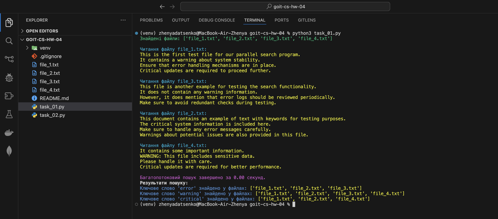
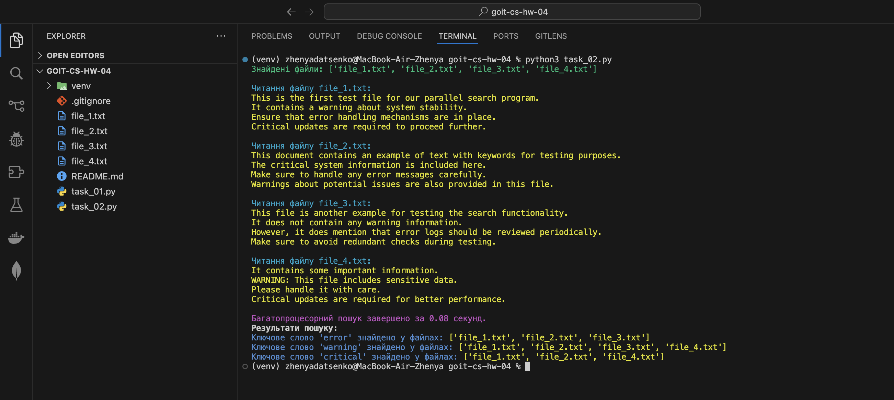

# Homework Assignment: Concurrency and Parallelism

## Topic

Implementing multithreading and multiprocessing approaches to perform parallel keyword searches in text files.

---

## Tasks

### 1. Multithreading

- Use the `threading` module to divide the task of searching keywords across multiple threads.
- Aggregate the results into a single dictionary.
- Measure and display execution time.

### 2. Multiprocessing

- Use the `multiprocessing` module to split the task across multiple processes.
- Collect results using shared resources like `Queue`.
- Measure and compare execution time with the multithreading approach.

---

## Results

Below is a screenshot of the program output showing the results for both approaches:

